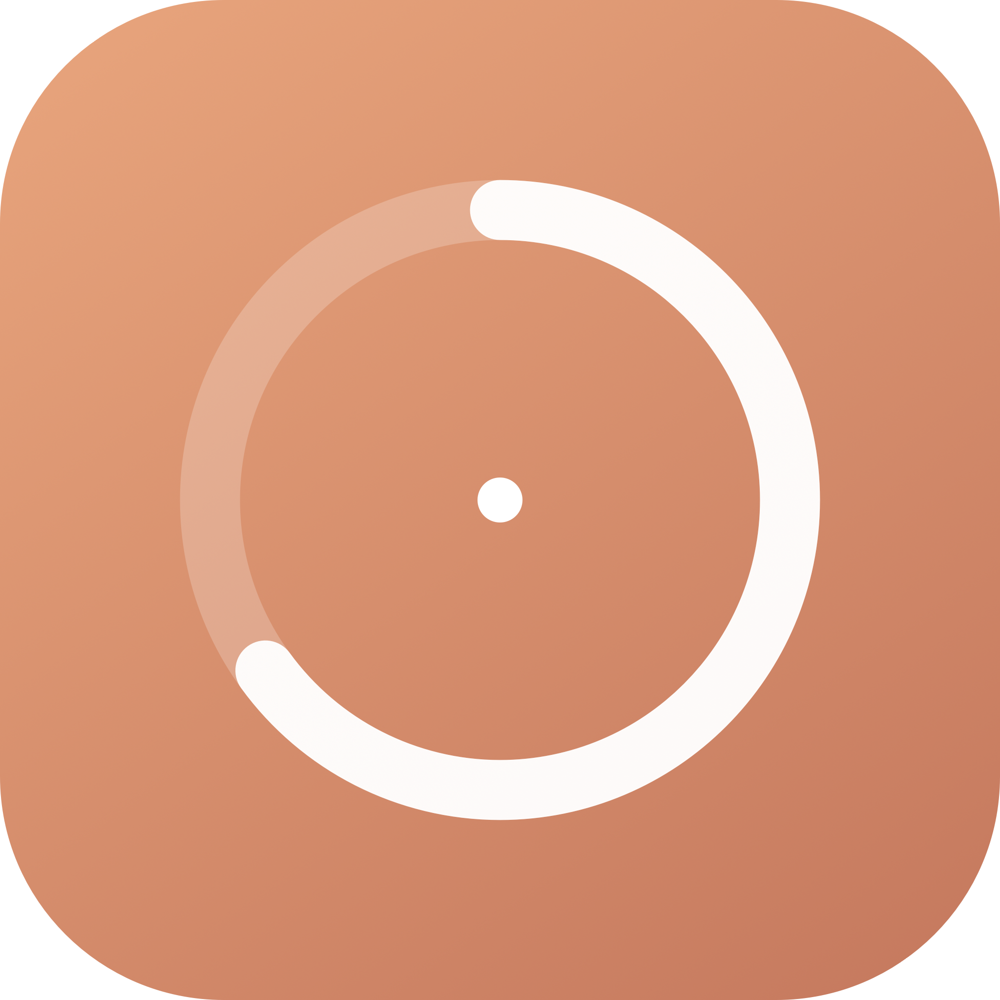

<p align="center">
  
</p>

<h1 align="center">Claudophobia</h1>

<p align="center">
  <i>For people with a phobia of running out of Claude.</i>
</p>

<p align="center">
  
  
  
  
  
  
</p>

A native macOS menu bar app that keeps an eye on your **Claude.ai usage quota** — the
5-hour **session** window and the 7-day **weekly** window — and sings a little ding
before you hit the wall.

On notch Macs it's also a **notch app**: a tiny pill lives inside the camera housing
and fluidly expands into a live usage card, Dynamic-Island style. Move your cursor
away and it tucks itself back in.

---

## ✨ Features

|                                |                                                                                                                                                                                        |
| ------------------------------ | -------------------------------------------------------------------------------------------------------------------------------------------------------------------------------------- |
| 🖥️ **Menu bar widget**         | Mini ring gauge with your session usage; click for the full popover — session + weekly rings, reset countdowns, all your accounts                                                      |
| 🍜 **Notch app**               | Pill inside the camera housing; hover or click to expand into a live card with gauges, a usage trend sparkline and an account switcher. **Auto-collapses when your cursor leaves**     |
| 👥 **Multi-account**           | Track any number of Claude accounts independently; switch the active one from the popover or the notch card                                                                            |
| 🔐 **In-app login**            | “Sign in with Claude” opens an embedded browser — your `sessionKey` is captured automatically and stored in the **Keychain**, never in a config file                                   |
| ⚠️ **Threshold alerts**        | Warns at **80%** by default (session & weekly, both configurable). One banner per crossing; re-arms automatically after usage drops                                                    |
| 🔔 **The ding**                | A synthesized chime (no audio assets) on warnings, and a happy two-note “all clear” when a quota refreshes. Mutable, previewable                                                       |
| 🎛️ **Configurable everything** | Update interval, notifications on/off, sound on/off, notify-on-reset, notch width & hover behavior, **open at startup (on by default)**, per-account rename / remove / re-authenticate |

## 📦 Install

Grab the latest `Claudophobia-macOS.zip` from the
**[Releases](https://github.com/erfanmola/claudophobia/releases)** page, unzip, and
drag `Claudophobia.app` into `Applications`.

> The app is ad-hoc signed (no Developer ID), so macOS may gate it the first time:
> right-click the app → **Open** → **Open** again. Launch-at-login requires the app
> to live in `/Applications`.

**First launch:** click the menu bar ring → **Sign in with Claude** → log in in the
embedded window → done.

## 🛠️ Build from source

Requires macOS 14+ and Xcode command line tools (no full Xcode project needed).

```sh
git clone https://github.com/erfanmola/claudophobia.git
cd claudophobia

./scripts/build_app.sh        # builds dist/Claudophobia.app (ad-hoc signed)
open dist/Claudophobia.app

swift test                    # unit tests
```

CI (`.github/workflows/build-and-release.yml`) builds and tests on every push, and
attaches a signed app zip to every `v*` tag release.

## 🧠 How it works

Claudophobia talks to the same consumer API claude.ai's own usage page uses
(undocumented — it may change):

```
GET https://claude.ai/api/organizations                → list of orgs
GET https://claude.ai/api/organizations/{org}/usage    → {
    "five_hour": { "utilization": 12.5, "resets_at": "…" },
    "seven_day": { "utilization": 45.0, "resets_at": "…" },
    "seven_day_sonnet": { … } | null
  }
```

Auth is the `sessionKey` cookie from claude.ai, sent as a `Cookie` header. It's
captured from the embedded login window, or you can paste one manually:
**Settings → Accounts → Paste session key**.

> ⚠️ **Disclaimer:** This is an unofficial, reverse-engineered API. If Anthropic
> changes it, Claudophobia will show the error in the popover and keep your last
> known data. Session keys are stored in your Keychain and never leave your machine.

## 🗂️ Project layout

```
Sources/Claudophobia/
  ClaudophobiaApp.swift     @main — MenuBarExtra + Settings scenes
  AppModel.swift            central state, polling loop, account lifecycle
  ClaudeAPI.swift           claude.ai REST client
  KeychainStore.swift       Keychain storage + sessionKey parsing
  ConfigStore.swift         JSON config (~/Library/Application Support/Claudophobia)
  ThresholdEvaluator.swift  pure threshold / re-arm / reset logic
  NotificationManager.swift banners + ding routing
  SoundPlayer.swift         AVAudioEngine chime synthesis
  LoginController.swift     embedded WKWebView login → cookie harvest
  NotchPanel.swift          NSPanel notch widget + fluid expansion
  MenuBarView.swift         popover + menu-bar ring label
  SettingsView.swift        General / Accounts / Notifications / About
  UsageViews.swift          gauges, cards, Charts sparkline
Tests/ClaudophobiaTests/    decoding, thresholds, session keys, config round-trip
scripts/build_app.sh        release build → .app bundle → ad-hoc codesign
.github/workflows/          build & release pipeline
```

## 🗺️ Roadmap

- [ ] Menu bar icon style options (segmented bars, battery style, % text)
- [ ] Historical usage persistence + weekly trend chart
- [ ] Sonnet-specific limit in the popover
- [ ] Keyboard shortcut to toggle the notch card

## 🤝 Contributing

PRs welcome. Keep it native, keep it configurable, and make sure
`swift test` stays green.

## 📄 License

MIT © 2026
